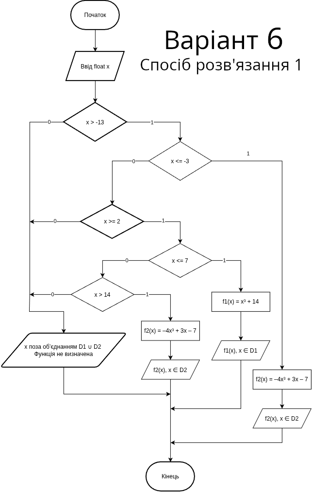
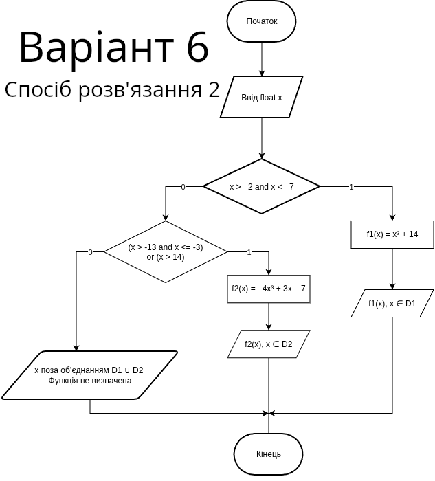
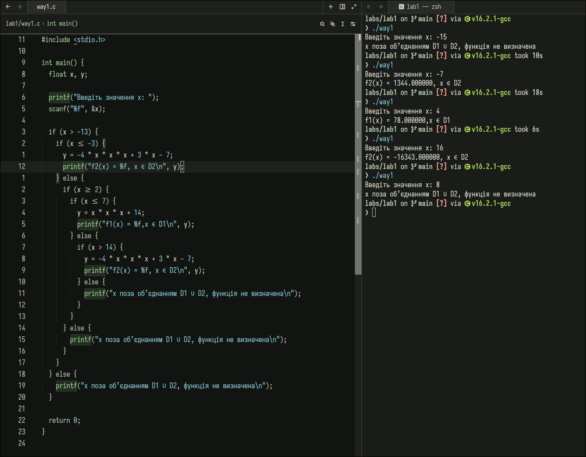
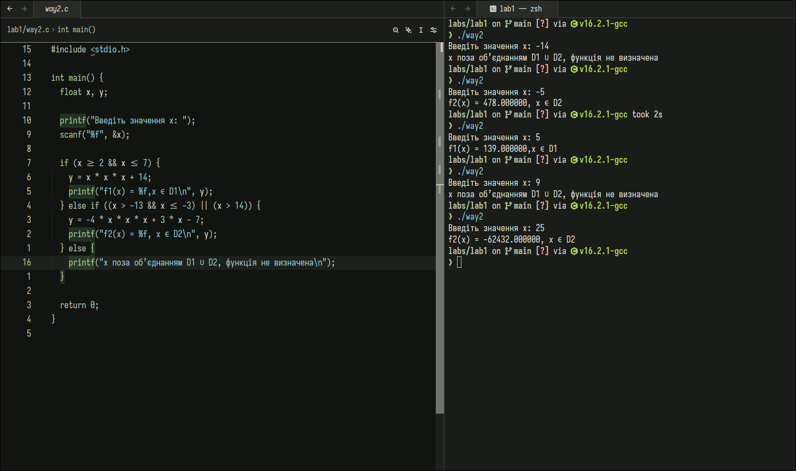

# Лабораторна робота № 1

## Розгалужені алгоритми

**Дисципліна:** Структури даних та алгоритми (СДА)
**Мова програмування:** С (не С++ і не будь-яка інша мова)

### Виконав

Студент групи: ІО-61\
Демяненко Сергій Юрійович\
Номер у списку групи: 6

## 1. Мета лабораторної роботи

Метою лабораторної роботи «Розгалужені алгоритми» є засвоєння теоретичного матеріалу та набуття практичних навичок використання керуючих конструкцій розгалуження та булевих (логічних) операцій.

## 3. Постановка задачі

Задано дійсне число x. Визначити значення заданої за варіантом кусково-неперервної функції y(x), якщо воно існує, або вивести на екран повідомлення про неіснування функції для заданого x.

Розв'язати задачу **двома способами** (написати дві програми):

1. У програмі дозволяється використовувати тільки одиничні операції порівняння (`=`, `<>`, `<`, `<=`, `>`, `>=`) і **не дозволяється** використовувати булеві (логічні) операції (`not`, `and`, `or` тощо);
2. У програмі необхідно **обов'язково** використати булеві (логічні) операції (`not`, `and`, `or` тощо); використання булевих операцій не повинно бути надлишковим.

### Завдання для варіанту 6

Для заданого дійсного x обчислити:

```
         f1(x) ,  x ∈ D1
y(x) =
         f2(x) ,  x ∈ D2
```

(для x поза об'єднанням D1 ∪ D2 функція не визначена — програма повинна вивести відповідне повідомлення).

| Варіант       | f1(x), x ∈ D1      | f2(x), x ∈ D2                          |
| ------------- | ------------------ | -------------------------------------- |
| **6**, 16, 26 | x³ + 14, x ∈ [2,7] | –4x³ + 3x – 7, x ∈ (–13,–3] ∪ (14, +∞) |

## 3. Діаграми

### Cпосіб 1



### Cпосіб 2



## 4. Програмний код

### Cпосіб 1

```c
#include <stdio.h>

int main() {
  float x, y;

  printf("Введіть значення x: ");
  scanf("%f", &x);

  if (x > -13) {
    if (x <= -3) {
      y = -4 * x * x * x + 3 * x - 7;
      printf("f2(x) = %f, x ∈ D2\n", y);
    } else {
      if (x >= 2) {
        if (x <= 7) {
          y = x * x * x + 14;
          printf("f1(x) = %f,x ∈ D1\n", y);
        } else {
          if (x > 14) {
            y = -4 * x * x * x + 3 * x - 7;
            printf("f2(x) = %f, x ∈ D2\n", y);
          } else {
            printf("x поза об’єднанням D1 ∪ D2, функція не визначена\n");
          }
        }
      } else {
        printf("x поза об’єднанням D1 ∪ D2, функція не визначена\n");
      }
    }
  } else {
    printf("x поза об’єднанням D1 ∪ D2, функція не визначена\n");
  }

  return 0;
}
```

### Спосіб 2

```c
#include <stdio.h>

int main() {
  float x, y;

  printf("Введіть значення x: ");
  scanf("%f", &x);

  if (x >= 2 && x <= 7) {
    y = x * x * x + 14;
    printf("f1(x) = %f,x ∈ D1\n", y);
  } else if ((x > -13 && x <= -3) || (x > 14)) {
    y = -4 * x * x * x + 3 * x - 7;
    printf("f2(x) = %f, x ∈ D2\n", y);
  } else {
    printf("x поза об’єднанням D1 ∪ D2, функція не визначена\n");
  }

  return 0;
}
```

## 5. Тестування

### Тестовий набір

| №   | Програма | Вхідне значення (x) | Очікуваний результат / Виведення                 |
| --- | :------- | :-----------------: | :----------------------------------------------- |
| 1   | ./way1   |         -15         | x поза об’єднанням D1 u D2, функція не визначена |
| 2   | ./way1   |         -7          | f2(x) = 1344.0, x ∈ D2                           |
| 3   | ./way1   |          4          | f1(x) = 78.0, x ∈ D1                             |
| 4   | ./way1   |         16          | f2(x) = -16343.0, x ∈ D2                         |
| 5   | ./way1   |          8          | x поза об’єднанням D1 u D2, функція не визначена |
| 6   | ./way2   |         -14         | x поза об’єднанням D1 u D2, функція не визначена |
| 7   | ./way2   |         -5          | f2(x) = 478.0, x ∈ D2                            |
| 8   | ./way2   |          5          | f1(x) = 139.0, x ∈ D1                            |
| 9   | ./way2   |          9          | x поза об’єднанням D1 u D2, функція не визначена |
| 10  | ./way2   |         25          | f2(x) = -62432.0, x ∈ D2                         |

### Спосіб 1



### Спосіб 1


