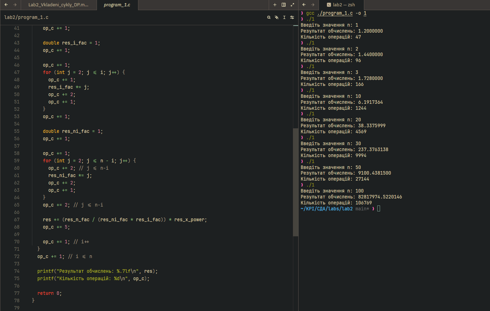
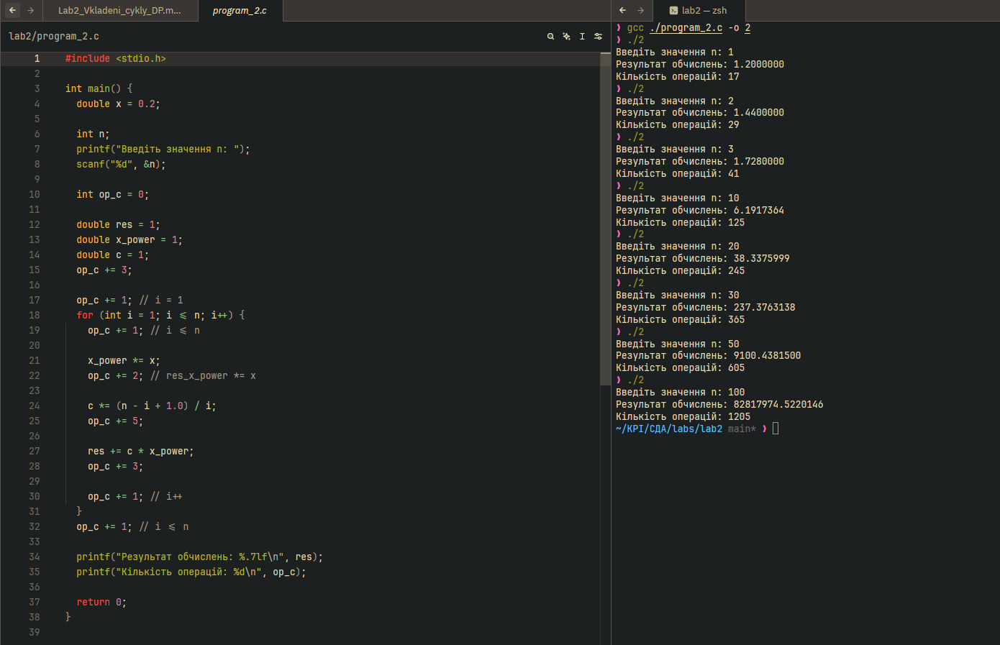
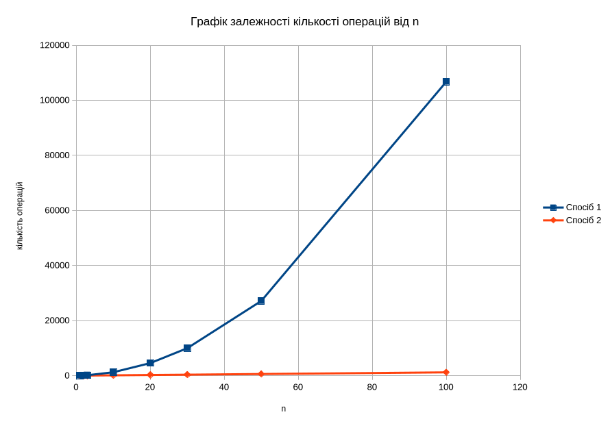
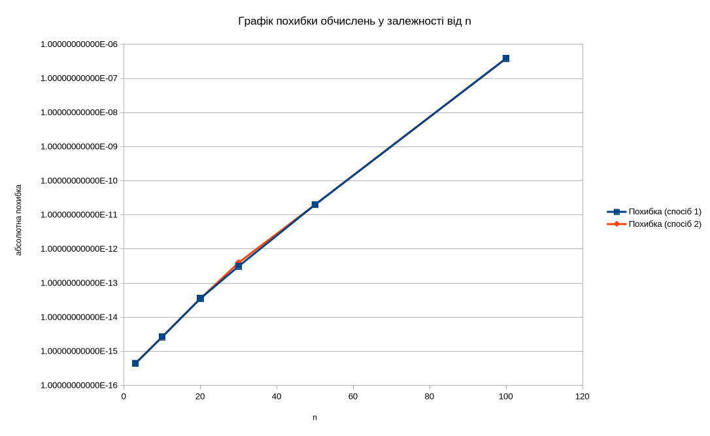
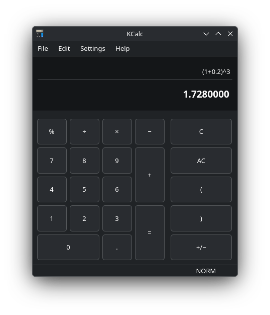
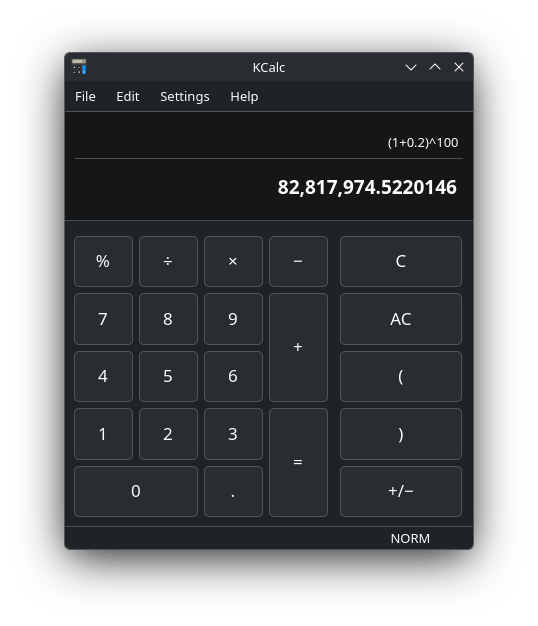

# Лабораторна робота № 2

## Алгоритми з вкладеними циклами та метод динамічного програмування

**Дисципліна:** Структури даних та алгоритми (СДА)  
**Мова програмування:** С

> Загальна інформація про курс (перелік робіт, система оцінювання, середовище розробки) — див. SDA_Course_Info.md / .docx.

### Виконав

Студент групи: ІО-61\
Демяненко Сергій Юрійович\
Номер у списку групи: 6

### Перевірив

Русінов Володимир Володимирович

---

## 1. Мета лабораторної роботи

Засвоєння теоретичного матеріалу та набуття практичних навичок використання різних циклічних керуючих конструкцій, вкладених циклів, методу динамічного програмування та обчислення кількості операцій алгоритмів.

## 2. Постановка задачі

1. Задане натуральне число n. Обчислити значення заданої за варіантом формули (ряду або добутку, що наближено обчислює значення певної функції у заданій точці; точність наближення залежить від кількості ітерацій n).
2. Для розв'язання задачі написати **дві програми**:
   1. перша програма обчислює формулу за допомогою **вкладених циклів**;
   2. друга програма обчислює ту саму формулу за допомогою **одного циклу** з використанням **методу динамічного програмування** (тобто накопичуючи черговий доданок/множник на основі попереднього, без повторного обчислення статечних, факторіальних і подібних виразів «з нуля» на кожній ітерації).
3. Виконати розрахунок кількості операцій для кожного з алгоритмів за методикою, викладеною на лекції, додавши до неї підрахунок кількості викликів стандартних функцій.
4. Програма має правильно розв'язувати задачу при будь-якому заданому n, для якого результат обчислення коректно представляється типом `double`.
5. Результат виводити у форматі із **сімома знаками після коми**.

### Завдання для варіанту 6

6. S = (1+x)^n = Σ(i=0..n) C(n,i) · x^i (x = 0.2)

## 3. Програмний код

### Програма 1

```c
#include <stdio.h>

int main() {
  double x = 0.2;

  int n;
  printf("Введіть значення n: ");
  scanf("%d", &n);

  int op_c = 0;

  double res = 0;
  op_c += 1;

  op_c += 1;
  for (int i = 0; i <= n; i++) {
    op_c += 1; // i <= n

    double res_x_power = 1;
    op_c += 1; // res_x_power = 1

    op_c += 1; // j = 1
    for (int j = 1; j <= i; j++) {
      op_c += 1; // j <= i
      res_x_power *= x;
      op_c += 2; // *=
      op_c += 1; // j++
    }
    op_c += 1; // j <= i (якщо false)

    double res_n_fac = 1;
    op_c += 1;

    op_c += 1;
    for (int j = 2; j <= n; j++) {
      op_c += 1;
      res_n_fac *= j;
      op_c += 2;
      op_c += 1;
    }
    op_c += 1;

    double res_i_fac = 1;
    op_c += 1;

    op_c += 1;
    for (int j = 2; j <= i; j++) {
      op_c += 1;
      res_i_fac *= j;
      op_c += 2;
      op_c += 1;
    }
    op_c += 1;

    double res_ni_fac = 1;
    op_c += 1;

    op_c += 1;
    for (int j = 2; j <= n - i; j++) {
      op_c += 2; // j <= n-i
      res_ni_fac *= j;
      op_c += 2;
      op_c += 1;
    }
    op_c += 2; // j <= n-i

    res += (res_n_fac / (res_ni_fac * res_i_fac)) * res_x_power;
    op_c += 5;

    op_c += 1; // i++
  }
  op_c += 1; // i <= n

  printf("Результат обчислень: %.7lf\n", res);
  printf("Кількість операцій: %d\n", op_c);

  return 0;
}
```

### Програма 2

```c
#include <stdio.h>

int main() {
  double x = 0.2;

  int n;
  printf("Введіть значення n: ");
  scanf("%d", &n);

  int op_c = 0;

  double res = 1;
  double x_power = 1;
  double c = 1;
  op_c += 3;

  op_c += 1; // i = 1
  for (int i = 1; i <= n; i++) {
    op_c += 1; // i <= n

    x_power *= x;
    op_c += 2; // res_x_power *= x

    c *= (n - i + 1.0) / i;
    op_c += 5;

    res += c * x_power;
    op_c += 3;

    op_c += 1; // i++
  }
  op_c += 1; // i <= n

  printf("Результат обчислень: %.7lf\n", res);
  printf("Кількість операцій: %d\n", op_c);

  return 0;
}
```

## 4. Скріншоти

### Програма 1



### Програма 2



## 5. Таблиці результатів

### Кількість операцій

| n                                                      | 1   | 2   | 3   | 10   | 20   | 30   | 50    | 100    |
| ------------------------------------------------------ | --- | --- | --- | ---- | ---- | ---- | ----- | ------ |
| Кількість операцій, спосіб 1 (вкладені цикли)          | 47  | 96  | 166 | 1244 | 4569 | 9994 | 27144 | 106769 |
| Кількість операцій, спосіб 2 (динамічне програмування) | 17  | 29  | 41  | 125  | 245  | 365  | 605   | 1205   |

### Абсолютна похибка (за еталон узято pow(1.2, n) та абсолютну похибку пораховано за допомогою fabs())

| n   | Похибка (спосіб 1) | Похибка (спосіб 2) |
| --- | ------------------ | ------------------ |
| 3   | 4.44089209850E-16  | 4.44089209850E-16  |
| 10  | 2.66453525910E-15  | 2.66453525910E-15  |
| 20  | 3.55271367880E-14  | 3.55271367880E-14  |
| 30  | 3.12638803734E-13  | 3.97903932026E-13  |
| 50  | 2.00088834390E-11  | 2.00088834390E-11  |
| 100 | 3.87430191040E-07  | 3.87430191040E-07  |

## 6. Графіки

### Графік залежності кількості операцій від n для кожного зі способів



### Графік похибки обчислень у залежності від n



## 7. Перевірка правильності обчислень

### Для n = 3



### Для n = 30


### Для n = 100



## 8. Висновки

У ході виконання лабораторної роботи було досліджено алгоритми з вкладеними циклами та метод динамічного програмування на прикладі обчислення суми S = (1+x)ⁿ = Σ C(n,i)·xⁱ при x = 0.2 (варіант 6). Для цього було написано дві програми мовою C: перша обчислює суму за допомогою вкладених циклів, друга за допомогою одного циклу з використанням динамічного програмування. Також було набуто практичних навичок підрахунку кількості операцій алгоритму, побудови графіків та перевірки результатів на калькуляторі.

Результати обох програм збігаються між собою до 7 знаків після коми та з перевіркою на калькуляторі для n = 3, 30 і 100. Це підтверджує правильність обох реалізацій.

При n = 100 спосіб 1 виконує 106 769 операцій проти 1 205 у способу 2. Тобто динамічне програмування потребує приблизно в 89 разів менше операцій, і ця різниця зростає зі збільшенням n.

Причина в тому, що в способі 1 на кожній ітерації xⁱ, n!, i! та (n−i)! обчислюються заново вкладеними циклами. У способі 2 кожен доданок отримують з попереднього: xⁱ = xⁱ⁻¹·x та C(n,i) = C(n,i−1)·(n−i+1)/i. Це наочно показує головну ідею методу: повторно використовувати вже обчислені результати замість того, щоб рахувати все «з нуля».

Похибку обчислювали як |S − pow(1.2, n)|. Вона зростає від ≈4.4·10⁻¹⁶ (n = 3) до ≈3.9·10⁻⁷ (n = 100) і для обох способів практично однакова. Причина в тому, що 1.2 у double не дорівнює 1 + 0.2 (відносна різниця ≈4.6·10⁻¹⁷), і ця різниця накопичується пропорційно n. Тож графік відображає насамперед обмежену точність подання чисел у double та похибку еталона, а не різницю між алгоритмами.

Отже, обидва способи дають однакову точність, але динамічне програмування значно ефективніше за кількістю операцій. Метод варто застосовувати скрізь, де наступний доданок чи множник можна виразити через попередній: це спрощує алгоритм, пришвидшує обчислення та зменшує накопичення помилок округлення.
